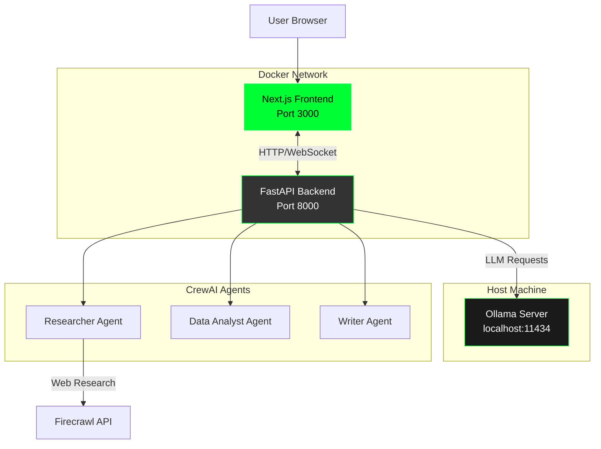

# D4BL Research and Analysis Tool

This tool combines web research, data analysis, and writing capabilities to investigate topics related to Data for Black Lives (D4BL). It uses AI agents to gather information, analyze data, generate insights, and create written summaries about data justice and racial equity issues.

## Features

- 🤖 **AI Agent System**: Multi-agent crew (Researcher, Data Analyst, Writer) powered by CrewAI
- 🌐 **Web Interface**: Modern Next.js frontend with real-time progress tracking
- 📊 **Live Agent Output**: Stream live agent activity and processing steps in real-time
- 🐳 **Docker Support**: Easy deployment with Docker Compose
- 🔄 **Real-time Updates**: WebSocket-based progress updates and live logs
- 📝 **Multiple Output Formats**: Brief, detailed, and comprehensive summaries
- 🎨 **D4BL Branding**: Custom styling with D4BL colors and logo

## Quick Start (Docker Compose + Supabase + Langfuse)

The easiest way to run the application is using Docker Compose with a local Ollama instance, a Supabase (Postgres) instance started by the Supabase CLI, and Langfuse for tracing.

### Prerequisites

- **Docker** and **Docker Compose** installed
- **Ollama** installed and running on your host machine
- **Mistral model** pulled in Ollama
- **Supabase CLI** installed (`brew install supabase/tap/supabase` or see Supabase docs)
- **Langfuse** requirements are bundled in Docker Compose (Postgres, ClickHouse, Redis)

See [Prerequisites Guide](docs/PREREQUISITES.md) for detailed setup instructions.

### Setup Steps

1. **Install and start Ollama**:
   ```bash
   # Install Ollama from https://ollama.ai
   ollama serve
   ollama pull mistral
   ```

2. **Create a `.env` file** in the project root:
   ```bash
   FIRECRAWL_API_KEY=your_firecrawl_api_key
   OLLAMA_BASE_URL=http://localhost:11434
   ```

3. **Start the application**:
   ```bash
   supabase start  # starts Supabase locally; Postgres listens on 54322
   docker-compose up --build d4bl-api d4bl-frontend langfuse
   ```

4. **Access the application**:
   - **Frontend**: http://localhost:3000
   - **Backend API**: http://localhost:8000
   - **API Docs**: http://localhost:8000/docs
- **Langfuse UI**: http://localhost:3001

### Database (Supabase)

- The app now connects to the Supabase Postgres instance started by `supabase start`.
- By default it uses `POSTGRES_HOST=host.docker.internal`, `POSTGRES_PORT=54322`, `POSTGRES_USER=postgres`, `POSTGRES_PASSWORD=postgres`, `POSTGRES_DB=postgres`.
- To point at a remote Supabase project, override those `POSTGRES_*` environment variables (and set SSL as required by your project).

### Tracing (Langfuse)

- Langfuse runs inside Docker Compose and is reachable from the host at `http://localhost:3001` and from services via `http://langfuse:3000`.
- Default credentials are seeded via env (override in `.env`):
  - `LANGFUSE_INIT_USER_EMAIL=admin@localhost`
  - `LANGFUSE_INIT_USER_PASSWORD=changeme-password`
- The API uses:
  - `LANGFUSE_PUBLIC_KEY` / `LANGFUSE_SECRET_KEY` (set your own)
  - `LANGFUSE_HOST` / `LANGFUSE_BASE_URL` (defaults point to the Docker service)

### Stopping the Application

```bash
docker-compose down
```

## Architecture

The application consists of three main components:



For detailed architecture documentation, see [Architecture Guide](docs/ARCHITECTURE.md).

## Usage

### Web Interface

1. Open http://localhost:3000 in your browser
2. Enter your research query
3. Select summary format (brief, detailed, or comprehensive)
4. Click "Start Research"
5. Watch live agent output and progress updates
6. View formatted results when complete

### Command Line Interface

For programmatic use, you can also use the CLI:

```bash
# Activate virtual environment (if not using Docker)
source .venv/bin/activate

# Run research
python src/d4bl/main.py "your research question here" --summary detailed
```

## Documentation

- **[Prerequisites](docs/PREREQUISITES.md)**: Detailed setup instructions for all prerequisites
- **[Architecture](docs/ARCHITECTURE.md)**: System architecture and component details
- **[API Reference](docs/API.md)**: API endpoints and WebSocket documentation
- **[Development Guide](docs/DEVELOPMENT.md)**: Local development without Docker
- **[Troubleshooting](docs/TROUBLESHOOTING.md)**: Common issues and solutions

## Project Structure

```
d4bl_ai_agent/
├── src/d4bl/              # Core application code
│   ├── api.py            # FastAPI backend with WebSocket support
│   ├── crew.py           # CrewAI agent definitions
│   └── main.py           # CLI entry point
├── ui-nextjs/            # Next.js frontend
│   ├── app/              # Next.js App Router
│   ├── components/       # React components
│   ├── hooks/            # Custom React hooks
│   └── lib/              # Utilities
├── docs/                 # Documentation
├── docker-compose.yml    # Docker Compose configuration
├── Dockerfile            # Backend Docker image
├── requirements.txt      # Python dependencies
└── README.md            # This file
```

## Troubleshooting

### Common Issues

**Docker: "ports are not available"**
- Ensure ports 3000 and 8000 are not in use

**Docker: "Cannot connect to Ollama"**
- Verify Ollama is running: `ollama serve`
- Check Ollama is accessible: `curl http://localhost:11434/api/tags`

**Docker: "model 'mistral' not found"**
- Pull the model: `ollama pull mistral`

**WebSocket connection fails**
- Ensure backend is running on port 8000
- Check firewall settings

For more troubleshooting help, see [Troubleshooting Guide](docs/TROUBLESHOOTING.md).

## Contributing

We welcome contributions! Please see our [Contributing Guidelines](docs/CONTRIBUTING.md) for details.

1. Fork the repository
2. Create a feature branch
3. Submit a pull request with a detailed description

## License

This tool is provided under the MIT License. See LICENSE file for details.

## Future Work

See [Future Work](docs/FUTURE_WORK.md) for planned improvements and features.
