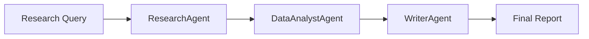

# Architecture Overview

## Component Diagram

The system consists of three main AI agents:

1. **ResearchAgent**
   - Handles web research
   - Manages search queries
   - Filters relevant content

2. **DataAnalystAgent**
   - Processes research data
   - Extracts key insights
   - Generates recommendations

3. **WriterAgent**
   - Creates structured summaries
   - Formats reports
   - Generates bibliographies

## Data Flow

[... rest of architecture documentation ...] 