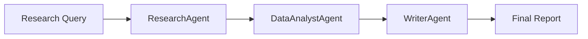

# Architecture Overview

## System Components

The D4BL Research Tool consists of three main AI agents working together:

### 1. ResearchAgent
- Handles web research
- Manages search queries
- Filters relevant content

### 2. DataAnalystAgent
- Processes research data
- Extracts key insights
- Generates recommendations

### 3. WriterAgent
- Creates structured summaries
- Formats reports
- Generates bibliographies

## Data Flow

## LLM Integration

The system uses both local and cloud-based LLMs:

### Local Models (Ollama)
- Llama 3.1 for research analysis
- Llama 3.2 for writing tasks

### Cloud Models (Groq)
- Llama 3 70B for complex tasks
- Mixtral 8x7B for diverse analysis
- Gemma 2 9B for focused tasks 