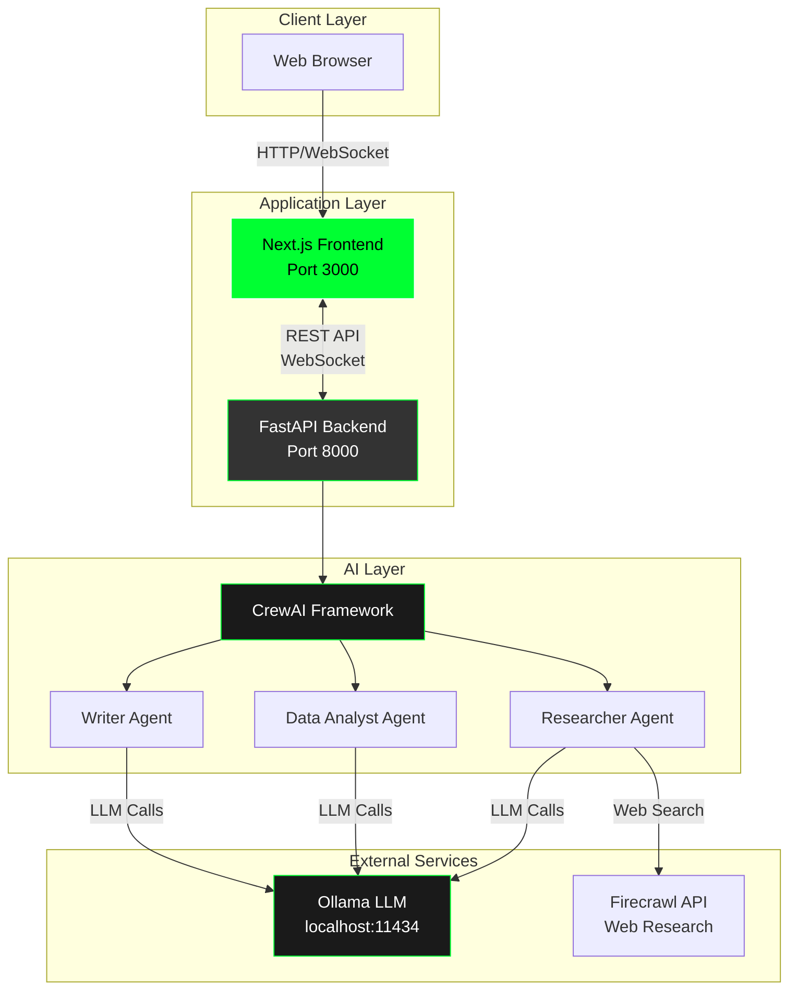
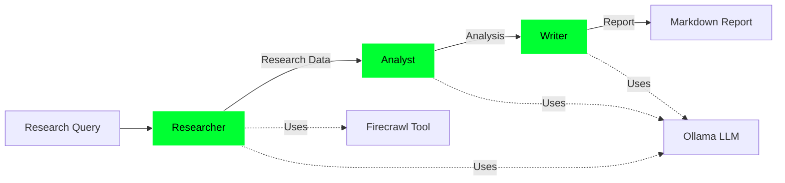
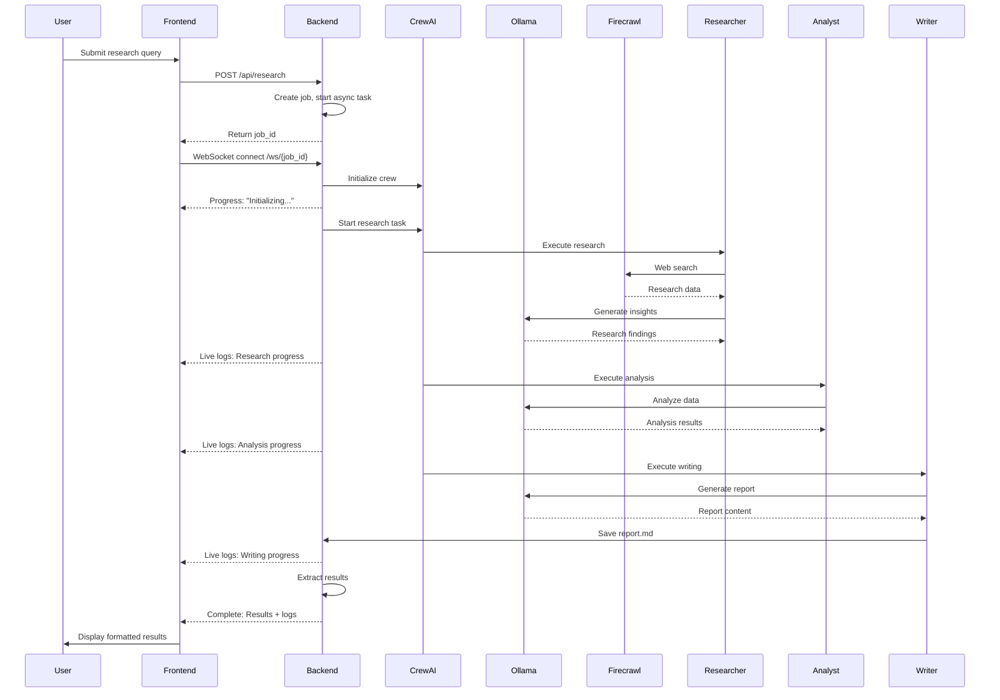
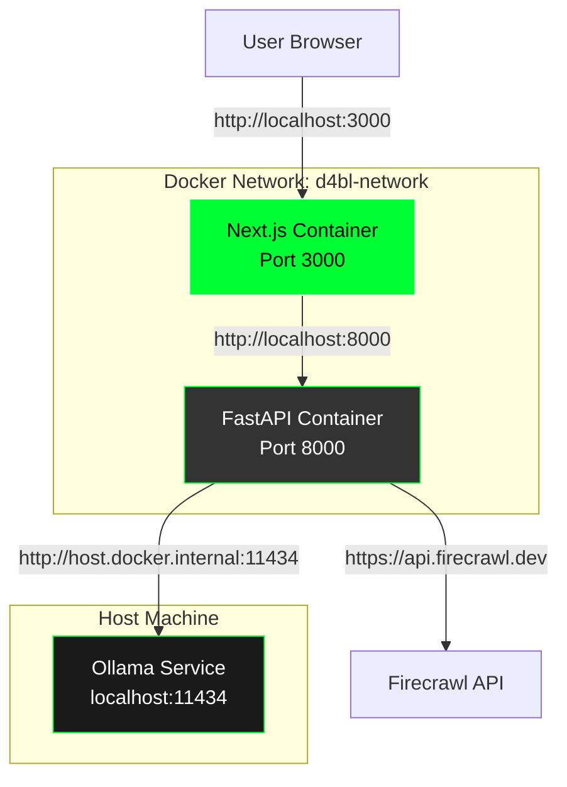

# Architecture

This document describes the architecture of the D4BL Research and Analysis Tool.

## System Overview

## Component Details

### Frontend (Next.js)

**Location**: `ui-nextjs/`

**Technology Stack**:
- Next.js 16 with App Router
- React 19 with TypeScript
- Tailwind CSS for styling
- WebSocket client for real-time updates

**Key Components**:
- `app/page.tsx`: Main page with research form and results display
- `components/ResearchForm.tsx`: Query input form
- `components/ProgressCard.tsx`: Progress indicator
- `components/LiveLogs.tsx`: Real-time agent output display
- `components/ResultsCard.tsx`: Formatted results display
- `hooks/useWebSocket.ts`: WebSocket connection management
- `lib/api.ts`: API client for backend communication

**Features**:
- Real-time progress updates via WebSocket
- Live agent output streaming
- Responsive design with D4BL branding
- Error handling and status indicators

### Backend (FastAPI)

**Location**: `src/d4bl/api.py`

**Technology Stack**:
- FastAPI for REST API and WebSocket support
- Uvicorn ASGI server
- CrewAI for agent orchestration
- Python 3.10-3.13

**Key Endpoints**:
- `POST /api/research`: Create research job
- `GET /api/jobs/{job_id}`: Get job status
- `WebSocket /ws/{job_id}`: Real-time updates
- `GET /api/health`: Health check
- `GET /docs`: OpenAPI documentation

**Features**:
- Asynchronous job processing
- WebSocket-based real-time communication
- Live output streaming from agents
- Error handling and recovery

### AI Agents (CrewAI)

**Location**: `src/d4bl/crew.py`

**Agent Architecture**:

**Agents**:

1. **Researcher Agent**
   - Role: Conducts web research on the query topic
   - Tools: FirecrawlSearchTool for web scraping
   - Output: Research findings and sources

2. **Data Analyst Agent**
   - Role: Analyzes research data and extracts insights
   - Tools: None (uses LLM for analysis)
   - Output: Key points, themes, and recommendations

3. **Writer Agent**
   - Role: Creates formatted reports and summaries
   - Tools: None (uses LLM for writing)
   - Output: Markdown report saved to `output/report.md`

**Process Flow**:
- Sequential execution (one agent after another)
- Each agent receives output from previous agent
- Final output is a comprehensive research report

## Data Flow

## Communication Patterns

### HTTP REST API

- **Request/Response**: Synchronous HTTP requests
- **Use Cases**: Job creation, status checks
- **Format**: JSON

### WebSocket

- **Bidirectional**: Real-time communication
- **Use Cases**: Progress updates, live logs
- **Message Types**:
  - `progress`: Status updates
  - `log`: Live agent output
  - `complete`: Job completion with results
  - `error`: Error notifications

### Live Output Streaming

The system captures stdout/stderr from CrewAI agents and streams it to the frontend:

1. Backend redirects stdout/stderr to custom handler
2. Handler queues log messages
3. Background task processes queue and sends via WebSocket
4. Frontend receives and displays logs in real-time

## Deployment Architecture

### Docker Compose Setup

**Key Points**:
- Frontend and backend run in separate containers
- Ollama runs on host machine (not containerized)
- Backend connects to Ollama via `host.docker.internal`
- Services communicate via Docker network

## Technology Choices

### Why FastAPI?
- Async support for concurrent requests
- Built-in WebSocket support
- Automatic OpenAPI documentation
- High performance

### Why Next.js?
- Server-side rendering capabilities
- Excellent developer experience
- TypeScript support
- Production-ready optimizations

### Why CrewAI?
- Multi-agent orchestration
- Built-in LLM integration
- Tool support
- Sequential and hierarchical process support

### Why Ollama?
- Local LLM execution (privacy)
- No API costs
- Fast inference
- Easy model management

## Security Considerations

- API keys stored in `.env` file (not committed)
- CORS configured for development
- No authentication (add for production)
- Input validation on API endpoints
- Error messages don't expose sensitive data

## Performance Considerations

- Asynchronous job processing
- WebSocket for efficient real-time updates
- Docker containerization for isolation
- LLM calls are the main bottleneck
- Consider caching for repeated queries

## Future Architecture Improvements

See [Future Work](FUTURE_WORK.md) for planned architectural enhancements.
