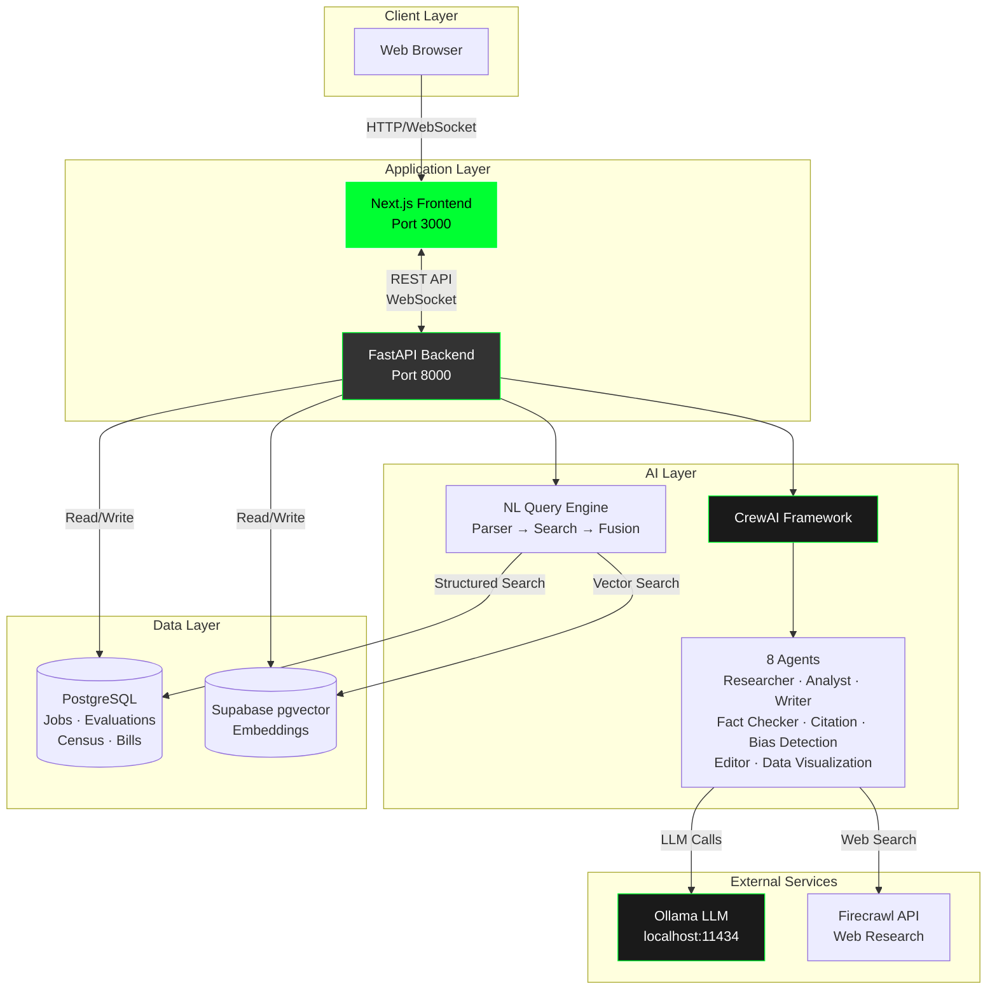
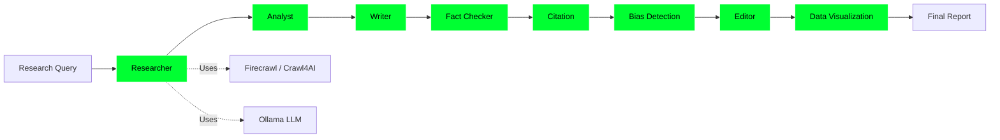
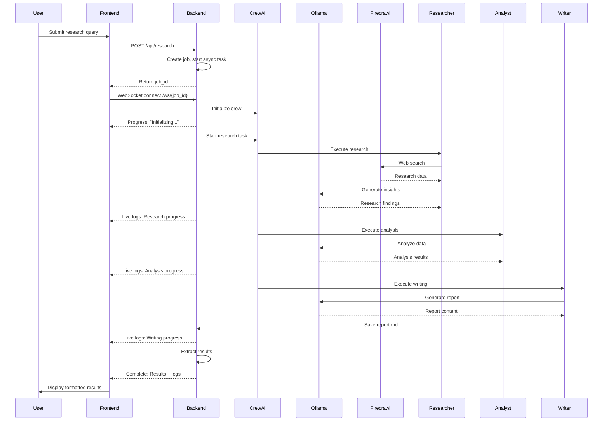
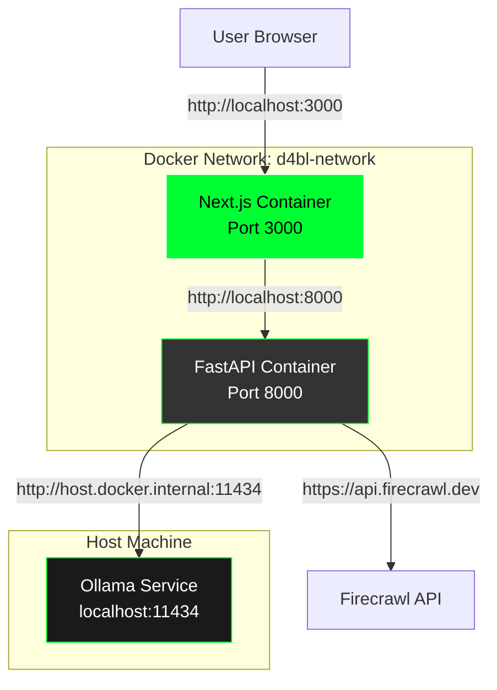

# Architecture

This document describes the architecture of the D4BL Research and Analysis Tool.

## System Overview

```mermaid
graph TB
    subgraph "Client Layer"
        Browser[Web Browser]
    end
    
    subgraph "Application Layer"
        Frontend[Next.js Frontend<br/>Port 3000]
        Backend[FastAPI Backend<br/>Port 8000]
    end
    
    subgraph "AI Layer"
        CrewAI[CrewAI Framework]
        Agents[8 Agents<br/>Researcher · Analyst · Writer<br/>Fact Checker · Citation · Bias Detection<br/>Editor · Data Visualization]
        QueryEngine[NL Query Engine<br/>Parser → Search → Fusion]
    end

    subgraph "Data Layer"
        Postgres[(PostgreSQL<br/>Jobs · Evaluations<br/>Census · Bills)]
        Supabase[(Supabase pgvector<br/>Embeddings)]
    end

    subgraph "External Services"
        Ollama[Ollama LLM<br/>localhost:11434]
        Firecrawl[Firecrawl API<br/>Web Research]
    end

    Browser -->|HTTP/WebSocket| Frontend
    Frontend <-->|REST API<br/>WebSocket| Backend
    Backend --> CrewAI
    Backend --> QueryEngine
    CrewAI --> Agents
    Agents -->|LLM Calls| Ollama
    Agents -->|Web Search| Firecrawl
    QueryEngine -->|Vector Search| Supabase
    QueryEngine -->|Structured Search| Postgres
    Backend -->|Read/Write| Postgres
    Backend -->|Read/Write| Supabase
    
    style Frontend fill:#00ff32,stroke:#fff,color:#000
    style Backend fill:#333,stroke:#00ff32,color:#fff
    style CrewAI fill:#1a1a1a,stroke:#00ff32,color:#fff
    style Ollama fill:#1a1a1a,stroke:#00ff32,color:#fff
```

## Component Details

### Frontend (Next.js)

**Location**: `ui-nextjs/`

**Technology Stack**:
- Next.js 16 with App Router
- React 19 with TypeScript
- Tailwind CSS for styling
- WebSocket client for real-time updates

**Key Components**:
- `app/page.tsx`: Main page with research form and results display
- `app/explore/page.tsx`: Interactive data explorer (Census ACS + legislative bills)
- `components/ResearchForm.tsx`: Query input form
- `components/ProgressCard.tsx`: Progress indicator
- `components/LiveLogs.tsx`: Real-time agent output display
- `components/ResultsCard.tsx`: Formatted results display
- `components/QueryBar.tsx`: Natural language query input
- `components/QueryResults.tsx`: Query answer + source citations
- `components/EvaluationsPanel.tsx`: LLM evaluation results display
- `components/explore/StateMap.tsx`: Interactive US choropleth map
- `components/explore/RacialGapChart.tsx`: Disparity bar chart
- `components/explore/PolicyTable.tsx`: Legislative bills table
- `components/explore/MetricFilterPanel.tsx`: Metric/race/year filters
- `hooks/useWebSocket.ts`: WebSocket connection management
- `lib/api.ts`: API client for backend communication

**Features**:
- Real-time progress updates via WebSocket
- Live agent output streaming
- Explore Data dashboard with map, charts, and policy tables
- Natural language querying with source citations
- Responsive design with D4BL branding
- Error handling and status indicators

### Backend (FastAPI)

**Location**: `src/d4bl/app/api.py`

**Technology Stack**:
- FastAPI for REST API and WebSocket support (lifespan context manager)
- Uvicorn ASGI server
- CrewAI for agent orchestration
- SQLAlchemy async with asyncpg
- Python 3.10-3.13

**Key Endpoints**:
- `POST /api/research`: Create research job
- `GET /api/jobs/{job_id}`: Get job status
- `GET /api/jobs`: Paginated job history
- `POST /api/query`: Natural language query with synthesized answer
- `POST /api/vector/search`: Vector similarity search
- `GET /api/vector/job/{job_id}`: Scraped content by job
- `GET /api/explore/indicators`: Census ACS indicator data
- `GET /api/explore/policies`: Legislative bill data
- `GET /api/explore/states`: Per-state metadata summary
- `GET /api/evaluations`: LLM evaluation results
- `WebSocket /ws/{job_id}`: Real-time updates
- `GET /api/health`: Health check
- `GET /docs`: OpenAPI documentation

**Features**:
- Asynchronous job processing
- WebSocket-based real-time communication
- Live output streaming from agents
- Structured logging throughout
- Exception chaining on all 500 handlers

### AI Agents (CrewAI)

**Location**: `src/d4bl/agents/crew.py`

**Agent Architecture**:

```mermaid
graph LR
    Input[Research Query] --> Researcher
    Researcher --> Analyst
    Analyst --> Writer
    Writer --> FactChecker[Fact Checker]
    FactChecker --> Citation
    Citation --> BiasDetection[Bias Detection]
    BiasDetection --> Editor
    Editor --> DataViz[Data Visualization]
    DataViz --> Output[Final Report]

    Researcher -.->|Uses| CrawlTool[Firecrawl / Crawl4AI]
    Researcher -.->|Uses| Ollama[Ollama LLM]

    style Researcher fill:#00ff32,stroke:#fff,color:#000
    style Analyst fill:#00ff32,stroke:#fff,color:#000
    style Writer fill:#00ff32,stroke:#fff,color:#000
    style FactChecker fill:#00ff32,stroke:#fff,color:#000
    style Citation fill:#00ff32,stroke:#fff,color:#000
    style BiasDetection fill:#00ff32,stroke:#fff,color:#000
    style Editor fill:#00ff32,stroke:#fff,color:#000
    style DataViz fill:#00ff32,stroke:#fff,color:#000
```

**Agents** (sequential execution order):

1. **Researcher** — Conducts web research using Firecrawl or Crawl4AI
2. **Data Analyst** — Analyzes research data and extracts insights
3. **Writer** — Creates formatted reports (`output/report.md`)
4. **Fact Checker** — Verifies facts and accuracy of research
5. **Citation Agent** — Manages citations and source attribution
6. **Bias Detection Agent** — Identifies potential biases in research/analysis
7. **Editor** — Edits and refines the final report (`output/report_edited.md`)
8. **Data Visualization Agent** — Creates charts and visualizations

**Process Flow**:
- Sequential execution (`Process.sequential`)
- Each agent receives output from the previous agent
- Memory enabled with Ollama embeddings (`mxbai-embed-large`)
- Supports optional agent selection via `selected_agents` parameter

## Data Flow

```mermaid
sequenceDiagram
    participant User
    participant Frontend
    participant Backend
    participant CrewAI
    participant Ollama
    participant Firecrawl
    
    User->>Frontend: Submit research query
    Frontend->>Backend: POST /api/research
    Backend->>Backend: Create job, start async task
    Backend-->>Frontend: Return job_id
    Frontend->>Backend: WebSocket connect /ws/{job_id}
    
    Backend->>CrewAI: Initialize crew
    Backend-->>Frontend: Progress: "Initializing..."
    
    Backend->>CrewAI: Start research task
    CrewAI->>Researcher: Execute research
    Researcher->>Firecrawl: Web search
    Firecrawl-->>Researcher: Research data
    Researcher->>Ollama: Generate insights
    Ollama-->>Researcher: Research findings
    Backend-->>Frontend: Live logs: Research progress
    
    CrewAI->>Analyst: Execute analysis
    Analyst->>Ollama: Analyze data
    Ollama-->>Analyst: Analysis results
    Backend-->>Frontend: Live logs: Analysis progress
    
    CrewAI->>Writer: Execute writing
    Writer->>Ollama: Generate report
    Ollama-->>Writer: Report content
    Writer->>Backend: Save report.md
    Backend-->>Frontend: Live logs: Writing progress
    
    Backend->>Backend: Extract results
    Backend-->>Frontend: Complete: Results + logs
    Frontend->>User: Display formatted results
```

## Communication Patterns

### HTTP REST API

- **Request/Response**: Synchronous HTTP requests
- **Use Cases**: Job creation, status checks
- **Format**: JSON

### WebSocket

- **Bidirectional**: Real-time communication
- **Use Cases**: Progress updates, live logs
- **Message Types**:
  - `progress`: Status updates
  - `log`: Live agent output
  - `complete`: Job completion with results
  - `error`: Error notifications

### Live Output Streaming

The system captures stdout/stderr from CrewAI agents and streams it to the frontend:

1. Backend redirects stdout/stderr to custom handler
2. Handler queues log messages
3. Background task processes queue and sends via WebSocket
4. Frontend receives and displays logs in real-time

## Deployment Architecture

### Docker Compose Setup

```mermaid
graph TB
    subgraph "Host Machine"
        Ollama[Ollama Service<br/>localhost:11434]
    end
    
    subgraph "Docker Network: d4bl-network"
        Frontend[Next.js Container<br/>Port 3000]
        Backend[FastAPI Container<br/>Port 8000]
    end
    
    User[User Browser] -->|http://localhost:3000| Frontend
    Frontend -->|http://localhost:8000| Backend
    Backend -->|http://host.docker.internal:11434| Ollama
    Backend -->|https://api.firecrawl.dev| Firecrawl[Firecrawl API]
    
    style Frontend fill:#00ff32,stroke:#fff,color:#000
    style Backend fill:#333,stroke:#00ff32,color:#fff
    style Ollama fill:#1a1a1a,stroke:#00ff32,color:#fff
```

**Key Points**:
- Frontend and backend run in separate containers
- Ollama runs on host machine (not containerized)
- Backend connects to Ollama via `host.docker.internal`
- Services communicate via Docker network

## Technology Choices

### Why FastAPI?
- Async support for concurrent requests
- Built-in WebSocket support
- Automatic OpenAPI documentation
- High performance

### Why Next.js?
- Server-side rendering capabilities
- Excellent developer experience
- TypeScript support
- Production-ready optimizations

### Why CrewAI?
- Multi-agent orchestration
- Built-in LLM integration
- Tool support
- Sequential and hierarchical process support

### Why Ollama?
- Local LLM execution (privacy)
- No API costs
- Fast inference
- Easy model management

## Security Considerations

- API keys stored in `.env` file (not committed)
- CORS configured for development
- No authentication (add for production)
- Input validation on API endpoints
- Error messages don't expose sensitive data

## Performance Considerations

- Asynchronous job processing
- WebSocket for efficient real-time updates
- Docker containerization for isolation
- LLM calls are the main bottleneck
- Consider caching for repeated queries

## Future Architecture Improvements

See [Future Work](FUTURE_WORK.md) for planned architectural enhancements.
