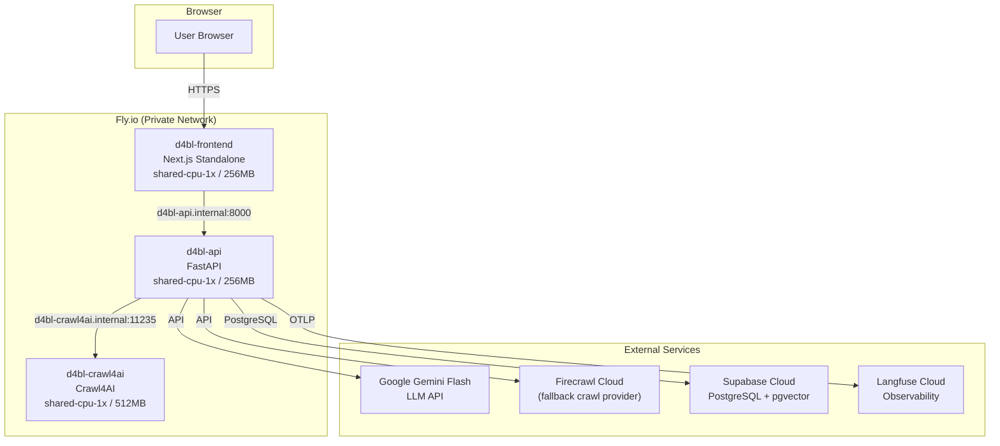
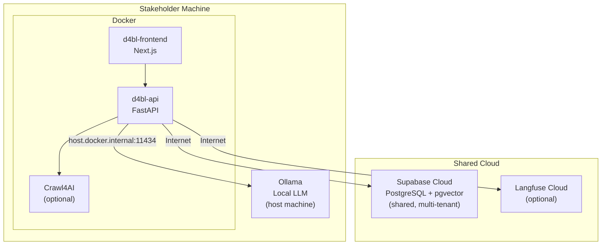
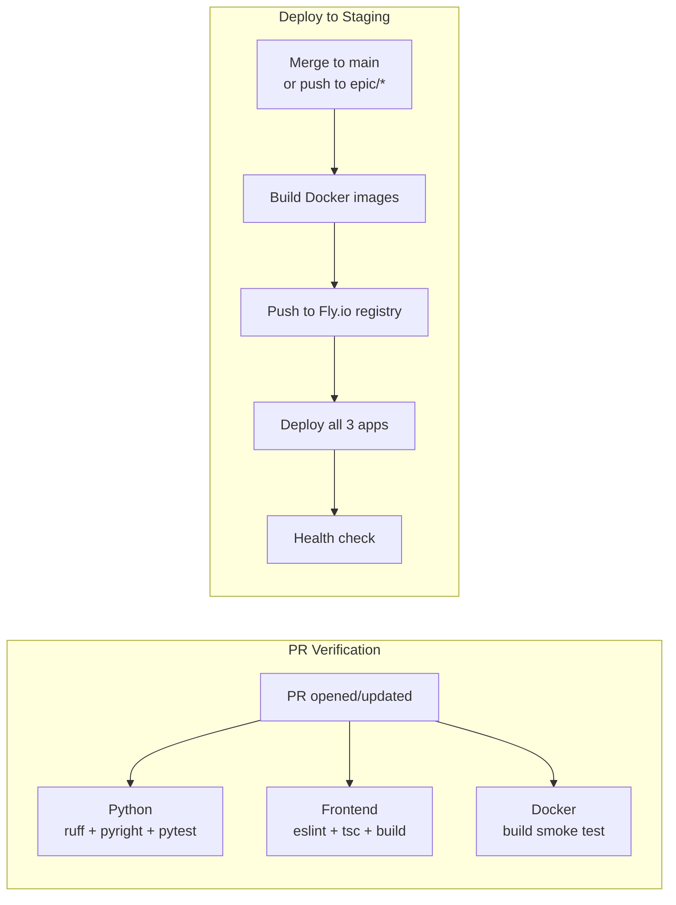

# Staging Environment & CI/CD Design

**Date:** 2026-03-05
**Status:** Proposed
**Selected approach:** Fly.io (Approach 1)

## Overview

Stand up a staging environment with CI/CD on GitHub Actions for PR verification and automated deployment. Enable configurable LLM providers (replacing local Ollama with commercial APIs for staging), and create a stakeholder distribution package for local use with a shared database.

## Architecture

### Staging Environment



### Stakeholder Local Deployment



### CI/CD Pipeline



## CI/CD Details

### PR Verification Workflow

Triggers on PRs to `main` and `epic/*` branches.

**Jobs:**

1. **python-checks**
   - Install dependencies from `requirements.txt`
   - Run `ruff check src/` (linting)
   - Run `pyright src/` or `mypy src/` (type checking)
   - Run `pytest` (unit tests)

2. **frontend-checks**
   - `cd ui-nextjs && npm ci`
   - `npm run lint`
   - `npx tsc --noEmit`
   - `npm run build`

3. **docker-build**
   - `docker build .` (backend)
   - `docker build ./ui-nextjs` (frontend)
   - No push — just verify images build cleanly

### Deploy to Staging Workflow

Triggers on:
- Merge to `main`
- Push to `epic/*` branches

Single staging environment — last deploy wins.

**Steps:**

1. Build backend and frontend Docker images
2. Deploy to Fly.io using `flyctl deploy`
3. Run health checks against staging URLs
4. Post deployment status to the GitHub commit

**GitHub Secrets required:**

| Secret | Purpose |
|--------|---------|
| `FLY_API_TOKEN` | Fly.io deployment auth |
| `GEMINI_API_KEY` | LLM API access |
| `SUPABASE_URL` | Database connection |
| `SUPABASE_ANON_KEY` | Supabase auth |
| `SUPABASE_SERVICE_ROLE_KEY` | Supabase admin operations |
| `LANGFUSE_PUBLIC_KEY` | Observability |
| `LANGFUSE_SECRET_KEY` | Observability |
| `FIRECRAWL_API_KEY` | Firecrawl Cloud (optional) |

## LLM Configurability

### Backend Changes

New environment variables:

| Variable | Default | Description |
|----------|---------|-------------|
| `LLM_PROVIDER` | `ollama` | LLM provider: `ollama`, `gemini`, `openai`, `anthropic`, etc. |
| `LLM_MODEL` | `mistral` | Model name within the provider |
| `LLM_API_KEY` | (none) | API key for commercial providers |

LiteLLM already handles provider routing. The model string passed to LiteLLM follows the format `{provider}/{model}`:
- `ollama/mistral` (local)
- `gemini/gemini-2.0-flash` (staging default)
- `openai/gpt-4o-mini`
- `anthropic/claude-haiku-4-5-20251001`

New API endpoints:
- `GET /api/models` — returns available models based on configured providers
- Research job request accepts an optional `model` parameter

### Frontend Changes

- LLM selector dropdown in the research form, populated from `/api/models`
- Selected model passed with the research job request
- Default model pre-selected based on server configuration

## Stakeholder Distribution Package

### Contents

- `docker-compose.stakeholder.yml` — simplified compose running backend + frontend + optional Crawl4AI
- `.env.stakeholder.example` — pre-configured with shared Supabase URL, stakeholder fills in their tenant ID
- `STAKEHOLDER_README.md` — setup guide: install Docker, install Ollama, pull model, configure env, run

### Multi-Tenancy

Basic tenant isolation via `tenant_id` column on `ResearchJob` and related tables:
- Each stakeholder is assigned a `tenant_id` (could be org name, email, or UUID)
- Set via `TENANT_ID` environment variable
- All queries filter by `tenant_id`
- No cross-tenant data visibility at the application layer

### Local vs. Shared Components

| Component | Runs where | Notes |
|-----------|-----------|-------|
| FastAPI + Next.js | Local (Docker) | Same images as staging |
| Ollama LLM | Local (host) | Stakeholder installs and runs |
| PostgreSQL | Supabase Cloud (shared) | Multi-tenant, internet-accessible |
| Vector store (pgvector) | Supabase Cloud (shared) | Same Supabase instance |
| Crawl4AI | Local (Docker, optional) | Included in stakeholder compose |
| Langfuse | Cloud (shared, optional) | Stakeholders can opt in |

## Fly.io Configuration

### Apps

| App name | Dockerfile | CPU | RAM | Internal address |
|----------|-----------|-----|-----|-----------------|
| `d4bl-api` | `./Dockerfile` | shared-cpu-1x | 256MB | `d4bl-api.internal:8000` |
| `d4bl-frontend` | `./ui-nextjs/Dockerfile` | shared-cpu-1x | 256MB | `d4bl-frontend.internal:3000` |
| `d4bl-crawl4ai` | `unclecode/crawl4ai` | shared-cpu-1x | 512MB | `d4bl-crawl4ai.internal:11235` |

### Networking

- All apps in the same Fly.io organization
- Private `.internal` DNS for inter-service communication
- Only `d4bl-frontend` exposed publicly (port 443)
- `d4bl-api` exposed publicly for WebSocket connections from the browser

### Environment Variables (Staging)

Backend (`d4bl-api`):
```
LLM_PROVIDER=gemini
LLM_MODEL=gemini-2.0-flash
LLM_API_KEY=<from secrets>
CRAWL_PROVIDER=crawl4ai
CRAWL4AI_BASE_URL=http://d4bl-crawl4ai.internal:11235
FIRECRAWL_API_KEY=<from secrets>
FIRECRAWL_BASE_URL=https://api.firecrawl.dev
POSTGRES_HOST=<supabase-host>
POSTGRES_PORT=5432
POSTGRES_USER=postgres
POSTGRES_PASSWORD=<from secrets>
POSTGRES_DB=postgres
LANGFUSE_HOST=https://cloud.langfuse.com
LANGFUSE_PUBLIC_KEY=<from secrets>
LANGFUSE_SECRET_KEY=<from secrets>
CORS_ALLOWED_ORIGINS=https://d4bl-frontend.fly.dev
```

Frontend (`d4bl-frontend`):
```
NEXT_PUBLIC_API_URL=https://d4bl-api.fly.dev
API_INTERNAL_URL=http://d4bl-api.internal:8000
```

---

## Deployment Options Comparison (for Leadership)

Three deployment approaches were evaluated. **Approach 1 (Fly.io)** is recommended.

### Approach 1: Fly.io (Recommended)

All three application containers deployed to Fly.io. Database and observability on managed cloud services.

| Component | Hosting | Est. Cost/mo |
|-----------|---------|-------------|
| FastAPI backend | Fly.io shared-cpu-1x, 256MB | ~$3.50 |
| Next.js frontend | Fly.io shared-cpu-1x, 256MB | ~$3.50 |
| Crawl4AI | Fly.io shared-cpu-1x, 512MB | ~$5.00 |
| PostgreSQL + vectors | Supabase Cloud free tier | $0 |
| LLM | Gemini Flash API (pay-per-use) | ~$1-5 |
| Observability | Langfuse Cloud free tier (50k obs/mo) | $0 |
| **Total** | | **~$13-18** |

**Pros:**
- Cheapest option, well within budget
- Docker-native deployment
- Private networking between services (`.internal` DNS)
- Existing account available
- Room to scale without hitting $50 ceiling

**Cons:**
- No native docker-compose — each service needs its own `fly.toml`
- Langfuse observability on cloud free tier (not self-hosted)

### Approach 2: Railway

All containers deployed as Railway services in a single project.

| Component | Hosting | Est. Cost/mo |
|-----------|---------|-------------|
| FastAPI backend | Railway, ~256MB | ~$7.50 |
| Next.js frontend | Railway, ~256MB | ~$7.50 |
| Crawl4AI | Railway, ~512MB | ~$15.00 |
| PostgreSQL + vectors | Supabase Cloud free tier | $0 |
| LLM | Gemini Flash API | ~$1-5 |
| Observability | Langfuse Cloud free tier | $0 |
| Hobby plan fee | | $5.00 |
| **Total** | | **~$36-40** |

**Pros:**
- Excellent developer experience and UI
- Easy environment variable management
- Good monorepo support
- Existing account available

**Cons:**
- ~2x the cost of Fly.io
- Pushes close to $50/mo budget ceiling
- Usage-based billing can lead to cost surprises

### Approach 3: Hybrid (Vercel + Fly.io)

Next.js on Vercel free tier, backend services on Fly.io.

| Component | Hosting | Est. Cost/mo |
|-----------|---------|-------------|
| Next.js frontend | Vercel free tier | $0 |
| FastAPI backend | Fly.io shared-cpu-1x | ~$3.50 |
| Crawl4AI | Fly.io shared-cpu-1x | ~$5.00 |
| PostgreSQL + vectors | Supabase Cloud free tier | $0 |
| LLM | Gemini Flash API | ~$1-5 |
| Observability | Langfuse Cloud free tier | $0 |
| **Total** | | **~$9-14** |

**Pros:**
- Cheapest option overall
- Vercel is optimized for Next.js (edge functions, CDN, analytics)
- Great free tier on Vercel

**Cons:**
- Split across two platforms — more operational complexity
- Vercel free tier limits: 100GB bandwidth, serverless function timeouts
- Requires a new Vercel account
- Different deployment model for frontend vs. backend

### Cost Summary

| Approach | Monthly Cost | Platform Complexity | Budget Headroom |
|----------|-------------|-------------------|----------------|
| **1. Fly.io** | ~$13-18 | Single platform | ~$32-37 |
| 2. Railway | ~$36-40 | Single platform | ~$10-14 |
| 3. Hybrid | ~$9-14 | Two platforms | ~$36-41 |

### Recommendation

**Approach 1 (Fly.io)** balances cost, simplicity, and capability. It keeps everything on a single platform while staying well under the $50/mo budget, leaving headroom for scaling up resources or adding services as the project grows.
